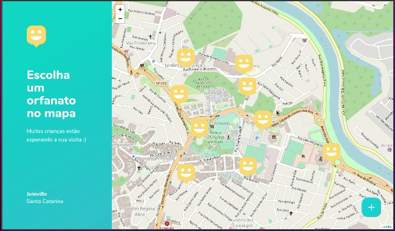
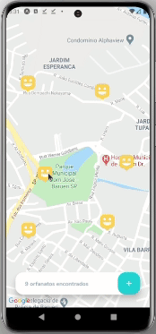

<h1 align="center">
  Next Level Week #03
</h1>

<p align="center">
  <a href="#project">Project</a>   |   
  <a href="#built-with">Built With</a>   |   
  <a href="#installation">Installation</a>   |   
  <a href="#deployment">Deployment</a>   |   
  <a href="#license">License</a>
</p>

<br>

# Project

Projeto Happy desenvolvido durante a Next Level Week (NLW) 03 da Rocketseat (Outubro/2020).

O Happy é uma plataforma de busca e agendamento de visitas a orfanatos/asilos. Pessoas podem encontrar locais próximos e conhecer as regras/disponibilidade. Após encontrar, o voluntário pode entrar em contato via Whatsapp.

<br>

## Web (desktop)



<br>

## Mobile

<!--- --->



<br>

# Built With

Este projeto foi desenvolvido em Typescript com as seguintes tecnologias:

Backend:

- [Node.js](https://nodejs.org/en/)
- [Express](https://www.npmjs.com/package/express)
- [TypeORM](https://typeorm.io/)
- [SQLite3](https://www.npmjs.com/package/sqlite3)
- [Insomnia](https://insomnia.rest/download/)
- [Multer](https://github.com/expressjs/multer)
- [Yup](https://github.com/jquense/yup)

Frontend:

- [React](https://reactjs.org/)
- [react-router-dom](https://reactrouter.com/web/guides/quick-start)
- [axios](https://www.npmjs.com/package/axios)
- [Leaflet](https://react-leaflet.js.org/docs/en/intro)

Mobile:

- [React Native](https://facebook.github.io/react-native/)
- [Expo](https://expo.io/)
- [axios](https://www.npmjs.com/package/axios)
- [react-navigation](https://reactnavigation.org/docs/getting-started)
- [expo-image-picker](https://docs.expo.io/versions/latest/sdk/imagepicker/)

<br>

# Installation

## Requirements

- Node
- Yarn
- Expo-cli

  ```
  yarn global add install expo-cli
  ```

<br>

## Installation Steps

- Clone this repository

  ```
  git clone https://github.com/renanxr3/nlw03
  ```

- Install Backend dependencies

  ```
  cd backend
  yarn install
  ```

- Create database

  ```
  yarn typeorm migration:run
  ```

- Install frontend dependencies

  ```
  cd web
  yarn install
  ```

- Install mobile dependencies

  ```
  cd mobile
  yarn install
  ```

<br>

# Deployment

## Backend

```
cd backend
yarn dev
```

## Frontend

```
cd web
yarn start
```

## Mobile

```
cd mobile
yarn start
```

<br/>

# Authors

- [Renan Santos](https://github.com/renanxr3)

<br/>

# License

This project is licensed under the [MIT License](LICENSE.md).

<br/>

# Acknowledgments

- [Rocketseat](https://rocketseat.com.br/)
- [Next Level Week](https://nextlevelweek.com/)
